# Distributed Image Processor - Complete Implementation Walkthrough

## Overview
Successfully implemented a distributed image processing backend with API Gateway, Worker Service, storage, queuing, caching, **Keycloak JWT authentication**, **RBAC**, **Prometheus/Grafana Monitoring**, and **Structured Logging**.

---

## Architectural Verification (End-to-End)

Verified the following flow on **Windows (PowerShell)** environment:

1. **Authentication & RBAC**:
   - Authenticated against Keycloak Realm `ImageProcessor`.
   - Verified `RequireRole("admin")` middleware protects sensitive endpoints.
   - **Delete Operation**:
     - Regular user `user`: `DELETE /api/v1/images/:id` -> **403 Forbidden**.
     - Admin user: `DELETE /api/v1/images/:id` -> **204 No Content**.

2. **API Gateway**:
   - `POST /api/v1/upload` accepted valid PNG image with Bearer token.
   - Saved file to Minio `raw-images` bucket.
   - Created DB record with `pending` status.
   - Published message to RabbitMQ.
   - **Metrics**: Exposed at `/metrics` (Scraped by Prometheus).
   - **Logging**: Zap JSON logs output to stdout.

3. **Worker Service**:
   - Consumed message from RabbitMQ.
   - Processed image (Resize + Grayscale).
   - Uploaded result to `processed-images` bucket.
   - **Metrics**: Exposed at `:9091/metrics`.
   - **Logging**: Zap JSON logs output to stdout.

4. **Monitoring**:
   - **Prometheus** (:9090) scraping API Gateway and Worker.
   - **Grafana** (:3001) connected to Prometheus.

---

## System Architecture

```mermaid
graph TB
    Client[HTTP Client]
    Keycloak[Keycloak Auth Server]
    Gateway[API Gateway :3000]
    Worker[Worker Service<br/>5 Goroutines]
    PG[(PostgreSQL :5433)]
    Redis[(Redis :6379)]
    Minio[Minio :9000/9001]
    RabbitMQ[RabbitMQ :5672]
    Prom[Prometheus :9090]
    Graf[Grafana :3001]
    
    Client -->|0. Get Token| Keycloak
    Client -->|1. POST /upload| Gateway
    Client -->|2. DELETE /images/:id| Gateway
    Gateway -->|Validate JWT + Role| Keycloak
    Gateway -->|Metrics| Prom
    Worker -->|Metrics| Prom
    Prom -->|Data| Graf
    Gateway -->|Logs| Stdout
    Worker -->|Logs| Stdout
    
    style Gateway fill:#4CAF50
    style Worker fill:#2196F3
    style Keycloak fill:#4D4D4D
    style Prom fill:#E6522C
    style Graf fill:#F46800
```



---

## Configuration Summary

- **URL**: `http://localhost:3000`
- **Keycloak URL**: `http://localhost:8080`
- **Prometheus**: `http://localhost:9090`
- **Grafana**: `http://localhost:3001` (admin/admin)
- **Metrics**:
  - API Gateway: `http://localhost:3000/metrics`
  - Worker: `http://localhost:9091/metrics`

### Verification Commands
```powershell
# Delete Image (Requires Admin Role)
curl -X DELETE http://localhost:3000/api/v1/images/<id> -H "Authorization: Bearer $token"

# Check Metrics
curl http://localhost:3000/metrics
curl http://localhost:9091/metrics
```
